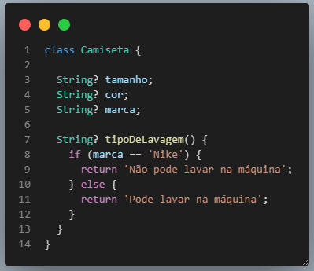

<h1 align="center">ATIVIDADES DESENVOLVIDAS NO CURSO DA ACADEMIA DO FLUTTER</h1>

 Dart POO ( Programação Orientada a Objeto).

### » TÓPICOS ESTUDADOS E CONSOLIDADOS:

- Fundamentos: Abstração e Encapsulamento;
- Classes: Atributos e comportamentos, Instanciado uma classe;
- Modificadores de tipos: Static - Atributos de classe e Métodos de classe;
- Modificadores de acesso: Public e Private, get e set;
- Constutores: Construtores nomeados e factory;
- Null Safaty: '!' Force non null, e 'late';
- Herança.
- Associação: Composição e agregação;
- Polimofismo;
- Interfaces;
- Mixins;
- Cascade noatation;
- Callable class;
- Operator Metods;
- Assigmento operators;
- Aplicando hasCode e equals;
- Aplicando regra de negócio com asserts em atribuos de classes;
- Otimizando a memória do projeto com o uso do const.
- Extensions - Atribuindo funções;
- Metadatas;

### Autor

